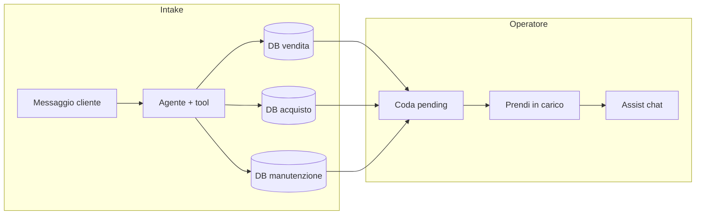

# POC — Helpdesk smistamento richieste + assistenza dipendente

Prototipo (**POC**) che simula l’arrivo di una **richiesta unificata** (mail/chat), lo **smistamento verso il reparto corretto** (tre database Postgres indipendenti) e la **chat operativa** per il dipendente dopo la **presa in carico** della pratica.

**Guida pratica step-by-step:** [docs/GUIDA_UTILIZZO_POC.md](docs/GUIDA_UTILIZZO_POC.md)  
**Record di seed nei DB (traccia UUID):** [docs/DATI_DATABASE_POC.md](docs/DATI_DATABASE_POC.md)

---

## Obiettivo e flusso funzionale

1. **Intake** — `POST /intake/chat`: messaggio del “cliente”. L’agente (LangGraph + LLM locale Ollama o Groq cloud) usa tool per **anagrafica** (`lookup_company_by_email`), **elenco reparti** (`list_helpdesks`) e, a richiesta completa, **apre il ticket** nel DB del settore con `route_and_open_ticket`. Stato iniziale del ticket: **`pending_acceptance`**.
2. **Coda** — `GET /departments/{reparto}/tickets/pending`: elenco pratiche in attesa per quel reparto.
3. **Presa in carico** — `POST /departments/{reparto}/tickets/{id}/accept` con `employee_id`: ticket in **`in_progress`** e assegnato al dipendente.
4. **Assistenza** — `POST /assist/chat`: chat multi-turno **solo** se il ticket è `in_progress` e **assegnato** al dipendente indicato nel body.

Interfaccia demo: **http://127.0.0.1:8000/ui/** (tab *Richiesta* e *Dipendente*).

### Diagramma logico (alto livello)



---

## Stack tecnico

| Componente | Uso |
|------------|-----|
| **FastAPI** | API HTTP, montaggio static `/ui` |
| **LangGraph** | Grafi intake e assist (fasi missione → ricognizione → … ) |
| **LangChain** | LLM: **Ollama** locale (`OLLAMA_MODEL`, default in `.env.example`) oppure **Groq** (`GROQ_MODEL`) |
| **asyncpg** | Accesso ai tre database |
| **MemorySaver** | Checkpointer in RAM per thread conversazione |

Struttura cartelle rilevante:

- `app/main.py` — endpoint e wiring grafi
- `app/agent/` — grafi, prompt, traccia UI-friendly
- `app/tools/` — tool intake e ticket per reparto
- `sql/` — schema e seed per reparto
- `static/` — UI statica

---

## Prerequisiti

- **Python 3.11+**
- **Docker Desktop** (o Docker Engine) per i tre Postgres
- **Ollama** ([ollama.com](https://ollama.com)): `ollama pull qwen2.5:7b` (o altro modello testuale; vedi `OLLAMA_MODEL` in `.env.example`). In alternativa, account **Groq** e [API key](https://console.groq.com) con `LLM_PROVIDER=groq`.

---

## Configurazione

1. Copia l’esempio delle variabili:

   ```powershell
   Copy-Item .env.example .env
   ```

2. Con **Ollama** (default): `LLM_PROVIDER=ollama`, avvia Ollama e scarica il modello indicato da `OLLAMA_MODEL`. Con **Groq**: `LLM_PROVIDER=groq` e **`GROQ_API_KEY`**. Le URL DB di default puntano a `localhost:6433`, `6434`, `6435` (allineate a `docker-compose.yml`).

---

## Database (tre istanze)

Avvio:

```powershell
docker compose up -d
```

Reset completo (dati persi):

```powershell
docker compose down -v
docker compose up -d
```

**DB già esistenti** (volumi non ricreati): aggiungere la tabella email simulate eseguendo `sql/patch_simulated_emails.sql` su ciascuna istanza (porte 5433, 5434, 5435), oppure `down -v` e ricreazione da `schema.sql` aggiornato.

| Servizio             | Porta host | Utente / password / DB |
|----------------------|------------|-------------------------|
| `postgres_vendita`   | **6433**   | `team` / `team` / `tickets` |
| `postgres_acquisto`  | **6434**   | idem |
| `postgres_manutenzione` | **6435** | idem |

---

## Avvio applicazione

```powershell
python -m venv .venv
.\.venv\Scripts\Activate.ps1
pip install -r requirements.txt
uvicorn app.main:app --reload --host 0.0.0.0 --port 8000
```

- **Health:** `GET http://127.0.0.1:8000/health`
- **OpenAPI / Swagger:** http://127.0.0.1:8000/docs
- **UI:** http://127.0.0.1:8000/ui/

---

## API — estratto

Tutti i dettagli (schemi, try-it-out) sono in **`/docs`**.

| Metodo | Path | Descrizione |
|--------|------|-------------|
| `POST` | `/intake/chat` | Messaggio cliente; opzionale `thread_id`. Risposta: `reply`, `trace`, e se il tool ha aperto la pratica **`routed_department`** + **`ticket_id`** |
| `GET`  | `/intake/thread` | Trascript conversazione intake (solo messaggi user/assistant “puliti”) |
| `GET`  | `/intake/simulated-mails?ticket_id=` | Email simulate inviate dal reparto verso il richiedente (POC) |
| `GET`  | `/departments/{dept}/employees` | Dipendenti attivi del reparto (`id`, `name`) — es. menu UI |
| `GET`  | `/departments/{dept}/tickets/pending` | Coda `pending_acceptance` per `vendita` \| `acquisto` \| `manutenzione` |
| `POST` | `/departments/{dept}/tickets/{ticket_id}/accept` | Body: `{ "employee_id": "..." }` |
| `POST` | `/assist/chat` | Body: `department`, `ticket_id`, `employee_id`, `message`, `thread_id` opzionale |
| `GET`  | `/assist/thread` | Storico chat assist per tripla dept/ticket/employee + `thread_id` |

### Esempio intake (PowerShell)

```powershell
curl.exe -X POST http://127.0.0.1:8000/intake/chat -H "Content-Type: application/json" -d "{\"message\": \"Da fleet@trasportinord.it: urgenza tagliando Scudo FN445LM\"}"
```

### Esempio presa in carico

```powershell
curl.exe -X POST http://127.0.0.1:8000/departments/manutenzione/tickets/TICKET_UUID/accept -H "Content-Type: application/json" -d "{\"employee_id\": \"f3010101-1010-1010-1010-101010101012\"}"
```

### Esempio assist

```powershell
curl.exe -X POST http://127.0.0.1:8000/assist/chat -H "Content-Type: application/json" -d "{\"department\": \"manutenzione\", \"ticket_id\": \"...\", \"employee_id\": \"f3010101-1010-1010-1010-101010101012\", \"message\": \"Riassumi il ticket e i prossimi passi\"}"
```

---

## Memoria conversazione (checkpointer)

- **Intake:** chiave `inbox:{thread_id}` dove `thread_id` è quello restituito dall’API (o generato lato client).
- **Assist:** chiave `assist:{department}:{ticket_id}:{employee_id}:{thread_id}`.

`MemorySaver` è **volatile**: riavvio del server = perdita dello **stato LangGraph**; i **record su Postgres** (ticket, clienti, ecc.) restano.

---

## Dipendenti di esempio (seed)

| Reparto      | Nome            | `employee_id` |
|-------------|-----------------|---------------|
| vendita     | Paola Ricambi   | `f1010101-1010-1010-1010-101010101010` |
| vendita     | Marco Banco     | `f1020202-2020-2020-2020-202020202020` |
| acquisto    | Sara Acquisti   | `f2010101-1010-1010-1010-101010101011` |
| acquisto    | Luca Fornitori  | `f2020202-2020-2020-2020-202020202021` |
| manutenzione| Giulia Officina | `f3010101-1010-1010-1010-101010101012` |
| manutenzione| Davide Meccanico| `f3020202-2020-2020-2020-202020202022` |

---

## Workflow agente (5 fasi)

Intake e assist condividono lo stesso schema a fasi: **missione** → **ricognizione (tool)** → **ragionamento** → **azione (tool)** → **sintesi**. I tool differiscono (intake: anagrafica + apertura ticket smistato; assist: CRUD ticket sul reparto nel contesto).

---

## Risoluzione problemi

| Problema | Verifica |
|----------|----------|
| Errore connessione DB | `docker compose ps`; porte 5433–5435 libere; URL in `.env` |
| 401/403 Groq | Solo se `LLM_PROVIDER=groq`: chiave valida e `GROQ_MODEL` disponibile sul piano |
| Errore connessione Ollama | Ollama in esecuzione; `OLLAMA_BASE_URL` corretto; modello già `pull` |
| Assist 403/400 | Ticket accettato con lo **stesso** `employee_id`; stato `in_progress` |
| UI non carica | Avviare uvicorn dalla root progetto; cartella `static/` presente |

---

## Licenza / uso

POC interna/demo: non utilizzare in produzione senza hardening (auth, segreti, persistenza checkpoint, osservabilità).
